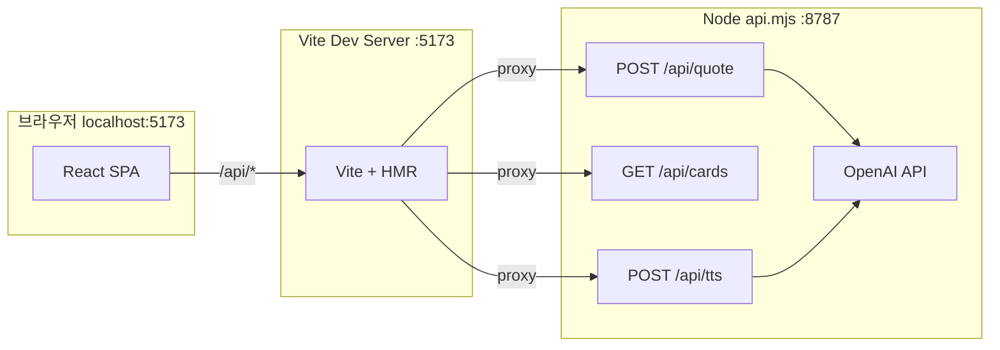

# 한국 출신 유명인 명언 카드 (React + Vite)

한국 태생 유명인의 명언을 GPT로 생성하고, 카드형 UI로 보여 주는 단일 페이지 웹앱입니다. OpenAI API 키는 브라우저가 아닌 **로컬 API 서버**에서만 사용합니다.

---

## 1. 기술 스택

| 구분 | 기술 | 버전(설치 시점 기준) | 용도 |
|------|------|------------------------|------|
| 런타임 | Node.js | 18+ 권장 | ESM(`"type": "module"`), `fetch`, 내장 `http` 서버 |
| 프론트 프레임워크 | React | ^19.0.0 | UI 컴포넌트, `useState` / `useEffect` / `useMemo` / `useCallback` |
| 번들·개발 서버 | Vite | ^6.0.3 | HMR, ESM 기반 개발, 프로덕션 빌드 |
| React 통합 | @vitejs/plugin-react | ^4.3.4 | JSX 변환, Fast Refresh |
| 동시 실행 | concurrently | ^9.1.2 | 개발 시 API 서버 + Vite 한 번에 기동 |
| 환경 변수 | dotenv | ^16.4.7 | API 서버에서 `.env` 로드 |
| LLM | OpenAI Chat Completions | REST `v1/chat/completions` | 구조화된 JSON 명언 데이터 생성 |
| 음성 | OpenAI Speech (TTS) | REST `v1/audio/speech` | 명언 한국어 음성(MP3). 카드별 디스크 캐시 시 재호출 없음 |
| 배경 이미지 | Pollinations (이미지 URL) | HTTPS GET | 프롬프트 기반 이미지 URL (별도 API 키 없음) |
| 폰트 | Pretendard Variable | CDN | 한글 가독성 (index.html 링크) |

언어: 프론트·서버 모두 **JavaScript(ESM)**. TypeScript 미사용.

---

## 2. 디렉터리 구조

```
korean-quote-card/
├── index.html              # 엔트리 HTML, Pretendard CDN
├── vite.config.js          # Vite 설정, 개발 프록시
├── package.json
├── .env                    # 로컬 전용 (git 제외). OPENAI_API_KEY 등
├── .env.example            # 환경 변수 템플릿
├── .gitignore
├── README.md
├── server/
│   ├── api.mjs             # Node HTTP 미니 API, OpenAI·TTS·캐시
│   └── data/
│       ├── defaultCards.json
│       ├── cards.json      # 로컬 생성분(보통 git 제외)
│       ├── searchLog.json  # 위키 조회 로그(보통 git 제외)
│       └── tts/            # TTS MP3 캐시 (*.mp3는 git 제외, .gitkeep만 추적)
└── src/
    ├── main.jsx            # ReactDOM createRoot, StrictMode
    ├── App.jsx             # 카드 UI, fetch, 배경 프리로드
    ├── App.css             # 카드·버튼·오버레이 스타일
    └── index.css           # 전역 reset·body
```

빌드 산출물: `npm run build` → `dist/` (정적 파일만; API 서버는 별도 실행 필요).

---

## 3. 개발 시 아키텍처

개발 모드(`npm run dev`)에서는 **두 개의 HTTP 서버**가 동시에 떠 있습니다.



| 서버 | 주소 | 역할 |
|------|------|------|
| Vite | `http://localhost:5173` | React 앱 서빙, `/api` 요청을 아래로 **프록시** |
| API | `http://127.0.0.1:8787` (기본) | `POST /api/quote`, `GET /api/cards`, `POST /api/tts`(음성·캐시), OpenAI·위키 이미지 |

`vite.config.js`의 `server.proxy["/api"]`가 `127.0.0.1:8787`로 넘겨 주므로, 프론트에서는 **상대 경로** `fetch("/api/quote", …)`만 사용하면 CORS·혼합 출처 문제를 피할 수 있습니다.

---

## 4. 환경 변수

API 서버(`server/api.mjs`)는 **프로젝트 루트의 `.env`**를 읽습니다 (`dotenv.config` 경로가 `../.env`로 상위 폴더 기준).

| 변수 | 필수 | 기본값 | 설명 |
|------|------|--------|------|
| `OPENAI_API_KEY` | 예* | 없음 | OpenAI [API 키](https://platform.openai.com/api-keys). *해당 카드의 TTS MP3가 `server/data/tts/`에 이미 있으면 `/api/tts`는 키 없이 캐시만 반환 |
| `OPENAI_MODEL` | 아니오 | `gpt-4o-mini` | Chat Completions에 사용할 모델 ID |
| `OPENAI_TTS_MODEL` | 아니오 | `tts-1` | Speech API 모델 |
| `OPENAI_TTS_VOICE` | 아니오 | `nova` | Speech API 음성 ([문서](https://platform.openai.com/docs/guides/text-to-speech)) |
| `API_PORT` | 아니오 | `8787` | 미니 API 서버 리슨 포트. 변경 시 `vite.config.js`의 `proxy.target`도 동일하게 맞출 것 |

`.env`는 `.gitignore`에 포함하는 것을 권장합니다.

---

## 5. NPM 스크립트

| 스크립트 | 명령 | 설명 |
|----------|------|------|
| `dev` | `concurrently … dev:api` + `dev:vite` | API(8787) + Vite(5173) 동시 기동. `-k`로 한쪽 종료 시 나머지도 종료 |
| `dev:vite` | `vite` | 프론트만 |
| `dev:api` | `node server/api.mjs` | API만 |
| `build` | `vite build` | `dist/` 프로덕션 번들 |
| `preview` | `vite preview` | 빌드 결과 로컬 미리보기 (API는 별도 실행 필요) |

---

## 6. API 명세 (`server/api.mjs`)

### 6.1 엔드포인트

- **`POST /api/quote`**: 명언 카드 1장 생성 후 **`server/data/cards.json`**에 append. 위키 이미지 조회 과정은 **`server/data/searchLog.json`**에 한 줄씩 누적(최대 약 800건). 본문은 현재 미사용(`{}` 가능). Content-Type `application/json` 권장.
- **`GET /api/cards`**: `cards.json`에 저장된 카드를 **최신순**으로 반환. 저장분이 **비어 있으면** 같은 형식의 **`server/data/defaultCards.json`**을 읽어 기본 10장을 돌려줌(레포에 포함되는 샘플 JSON).
- **`POST /api/tts`**: 명언 한국어(`text`)를 OpenAI Speech로 MP3 합성. 요청에 **`cardId`**(카드 `id`)가 오면 `server/data/tts/{cardId}.mp3`가 있을 때 **디스크 캐시만 반환**(OpenAI 호출·과금 없음). 없으면 합성 후 같은 경로에 저장하고 응답. `cardId`는 UUID 또는 `default-seed-01`처럼 `a-zA-Z0-9_-`만 포함하는 안전한 문자열만 파일명으로 허용.
- **응답 Content-Type**: `application/json; charset=utf-8` (JSON API). `/api/tts` 성공 시는 `audio/mpeg`.
- **CORS**: `Access-Control-Allow-Origin: *` (개발 편의). 프로덕션에서는 출처 제한 권장.

### 6.2 `POST /api/quote` 성공 응답 (200)

```json
{
  "ok": true,
  "card": {
    "id": "uuid",
    "createdAt": "2026-05-04T12:34:56.789Z",
    "quoteKo": "…",
    "quoteEn": "…",
    "personNameKo": "…",
    "…": "OpenAI JSON 필드 + 위키 썸네일 필드(있을 때)"
  }
}
```

`card`는 OpenAI JSON 필드에 `id`, `createdAt`을 붙인 한 레코드이며, 위키 이미지가 붙으면 `heroImageUrl` 등이 포함됩니다. 프론트는 최소 `quoteKo`, `quoteEn` 존재 여부만 검사합니다.

### 6.2b `GET /api/cards` 성공 응답 (200)

```json
{
  "ok": true,
  "cards": [ { "id": "…", "createdAt": "…", "quoteKo": "…", … }, … ]
}
```

### 6.3 기대 필드 (시스템 프롬프트 기준)

| 필드 | 타입 | 설명 |
|------|------|------|
| `quoteKo` | string | 한국어 명언 본문 |
| `quoteEn` | string | 영문 번역 |
| `personNameKo` | string | 인물 이름(한국어 표기) |
| `achievementsKo` | string | 주요 업적·역할 한 줄 |
| `birthYear` | number \| null | 출생 연도. 기원전은 음수 |
| `deathYear` | number \| null | 사망 연도. 생존 시 null |
| `usageKo` | string | 명언이 알려진 맥락(연설·저서 등) |
| `imagePromptEn` | string | 배경 이미지용 영문 장면·분위기 설명(짧게) |
| `moodHue` | number | 0–360, 로딩 플레이스홀더 그라데이션 색상용 |
| `heroImageUrl` 등 | string (선택) | 서버가 위키에서 붙인 썸네일 URL·출처 메타 |
| `id`, `createdAt` | string | `POST /api/quote` 응답·저장 레코드에만 존재 |

### 6.4 `POST /api/tts` 요청·캐시

- **Content-Type**: `application/json`
- **본문**: `{ "text": "<명언 한국어, 최대 4096자>", "cardId": "<카드 id>" }` — `cardId`는 캐시 파일명에 사용(위 안전 규칙). 생략 시 매번 OpenAI만 호출하고 디스크에는 저장하지 않음.
- **성공 (200)**: MP3 바이너리. 응답 헤더 `X-TTS-Source`: `cache`(캐시 히트) 또는 `openai-cached-next` / `openai`(신규 합성).
- **캐시 무효화**: 같은 `cardId`로 명언 본문을 바꾼 뒤 음성까지 맞추려면 해당 `server/data/tts/{cardId}.mp3`를 삭제한 뒤 다시 재생하면 됨.

### 6.5 OpenAI 호출 상세

- **엔드포인트**: `https://api.openai.com/v1/chat/completions`
- **옵션**: `response_format: { type: "json_object" }` — 응답을 JSON 객체로 유도
- **temperature**: `0.92` (다양한 인물·주제 유도; `api.mjs` 참고)
- **시스템 역할**: 인물은 **한국(남·북, 역사적 한반도) 태생**으로 제한, 인용은 실제·널리 인용되는 문장 위주 등 (자세한 문구는 `server/api.mjs`의 `SYSTEM` 상수 참고)

### 6.6 오류 응답

- 키 없음: `500`, `{ "ok": false, "error": "OPENAI_API_KEY is not set in .env" }`
- OpenAI 오류: HTTP 상태는 가능하면 업스트림 코드, 본문 `{ "ok": false, "error": "…" }`

---

## 7. 프론트엔드 (`src/App.jsx`)

### 7.1 상태

| state | 타입 | 용도 |
|-------|------|------|
| `cards` | 배열 | `GET /api/cards` + 새로 생성한 카드(최신이 앞). 캐러셀 슬라이드 |
| `activeIndex` | number | 가운데(메인)에 보이는 카드 인덱스 |
| `loading` | boolean | `POST /api/quote` 진행 중 |
| `listLoading` | boolean | 저장 목록 최초 로드 |
| `error` | string | 실패 메시지 표시 |

### 7.2 데이터 흐름

1. 마운트 시 `GET /api/cards`로 목록 로드 → `setCards`(`cards.json`이 비어 있으면 서버가 `defaultCards.json` 내용을 돌려줌)
2.「새 명언 카드 만들기」→ `POST /api/quote` → 성공 시 `json.card`를 목록 **맨 앞**에 넣고 `activeIndex = 0`(가운데 메인)
3. 각 카드: 상단 히어로 이미지 + 하단 명언 영역. 명언 영역은 **동일 이미지를 CSS 배경**으로 두고(`card-body--bg`), 밝은 스크림으로 가독성 유지
4. 캐러셀: 좌우 **드래그(포인터)** 또는 **‹ ›** 버튼으로 이전·다음 카드 탐색. 카드가 2장 이상이면 캐러셀 아래 **인덱스 스크롤바(range)** 로도 이동 가능
5. **음성(TTS)**: 상단 **플레이어(재생/일시정지·진행 바)** 또는 가운데 카드 **「명언 듣기」**로 `/api/tts` 호출. 서버가 `cardId` 기준으로 캐시 MP3가 있으면 API 과금 없이 재생
6. 카드 레이아웃: 한글 → (명언 듣기 버튼) → 영문 → 이름 → 업적 → 맥락 → `formatLifeSpan`으로 생애 한 줄

### 7.3 생애 표기 (`formatLifeSpan`)

- `birthYear` / `deathYear`를 숫자로 해석; BCE는 음수 → `기원전 N년` 표기
- 둘 다 없으면 `생몰년 미상`, 사망만 없으면 `… ~ 현재` 등

### 7.4 배경 이미지 URL (`buildPollinationsUrl`)

- 베이스: `https://image.pollinations.ai/prompt/{encodeURIComponent(prompt)}?width=960&height=540&nologo=true`
- `imagePromptEn`이 비어 있으면 고정 폴백 문구 사용
- 프롬프트 길이 상한 약 280자(클라이언트에서 `slice`)

### 7.5 로딩 시 배경

이미지가 뜨기 전에는 카드 셸(`card-shell`)에 **HSL 그라데이션**을 인라인 스타일로 깔습니다.

- GPT가 준 `moodHue`(0–360)가 유효하면 사용
- 아니면 `quoteKo` 문자열 해시 기반 `fallbackGradientHue`로 색상 분기

### 7.6 스타일 (`App.css` / `index.css`)

- 카드: 상단 히어로 이미지 + 하단 명언 영역. 명언 영역은 `card-body--bg`로 **동일 이미지 배경**(가시성 위해 불투명도·밝은 스크림 조합)
- 캐러셀: 가운데 카드 확대, 양옆 카드 축소·투명도 (`carousel-slide-inner`)
- 본문: 구분선(`divider`)으로 블록 분리
- 전역 폰트: Pretendard Variable (CDN)

---

## 8. 보안·운영 참고

- **API 키**: 브라우저 번들에 넣지 않음. `.env`는 API 프로세스만 읽음.
- **프로덕션**: `dist/`만 정적 호스팅할 경우 **`/api/quote`·`/api/cards`를 제공할 백엔드**가 필요합니다. 동일 Node 스크립트를 리버스 프록시 뒤에 두거나, 서버리스 함수로 이전하는 방식이 일반적입니다.
- **저장소**: `server/data/cards.json`, `server/data/searchLog.json`, `server/data/tts/*.mp3`는 `.gitignore`에 두는 것을 권장(로컬·개인 데이터·캐시). **`server/data/defaultCards.json`**과 **`server/data/tts/.gitkeep`**은 저장소에 포함하는 것을 권장.
- **Pollinations / 위키**: 외부 이미지 의존. 실패 시 히어로는 그라데이션 위주로 보이거나, 위키 실패 후 Pollinations 폴백이 동작합니다.
- **CORS**: API가 `Access-Control-Allow-Origin: *`로 응답 — 배포 전에는 도메인 제한을 검토할 것.

---

## 9. 실행·빌드 (요약)

```bash
cd korean-quote-card
cp .env.example .env   # Windows: copy .env.example .env
# .env에 OPENAI_API_KEY 입력
npm install
npm run dev
```

브라우저: **http://localhost:5173**

```bash
npm run build
npm run preview
```

`preview`는 정적 파일만 서빙하므로, 명언 생성을 쓰려면 API 서버를 별도로 `npm run dev:api`로 띄우고, 프록시 없이 배포했다면 프론트의 `fetch` URL을 환경에 맞게 수정해야 합니다.

---

## 10. 참고 링크

- [Vite](https://vite.dev/)
- [React](https://react.dev/)
- [OpenAI Chat Completions](https://platform.openai.com/docs/api-reference/chat/create)
- [OpenAI Text to speech](https://platform.openai.com/docs/guides/text-to-speech)
- [Pollinations 이미지](https://pollinations.ai/) (프롬프트 기반 이미지 URL)
